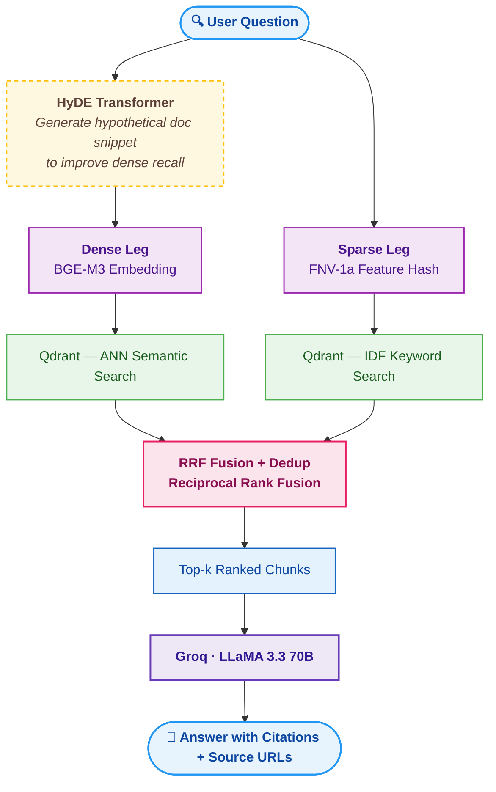

# RAG PyTorch Documentation Assistant

A retrieval-augmented generation (RAG) system that answers questions about PyTorch using the official documentation as its knowledge base. It combines dense semantic search with keyword search, re-ranks results with Reciprocal Rank Fusion, and generates citation-backed answers via a hosted LLM.

---

## How It Works



The pipeline is split into four sequential stages, each with its own notebook:

| Notebook | Stage | Output |
|---|---|---|
| `01_data_acquisition` | Crawl & convert PyTorch docs | Markdown files + JSONL index |
| `02_chunking` | Split pages into retrieval units | `Chunk` objects |
| `03_embedding_ingestion` | Embed chunks and upsert to Qdrant | Populated vector collection |
| `04_rag_chain` | Query the chain end-to-end | `RAGResult` with answer + citations |

---

## Project Structure

```
rag-techdoc-assistant/
├── devenv.nix                # devenv shell & package configuration
├── devenv.yaml               # devenv inputs / follows
├── pyproject.toml            # project metadata & dependencies (uv)
├── .env                      # secrets (not committed)
├── LICENSE
│
├── notebooks/
│   ├── 01_data_acquisition.ipynb
│   ├── 02_chunking.ipynb
│   ├── 03_embedding_ingestion.ipynb
│   └── 04_rag_chain.ipynb
│
└── src/
    ├── data_acquisition/
    │   ├── discovery.py      # sitemap crawl → URL list
    │   ├── fetcher.py        # rate-limited HTTP fetcher
    │   ├── cleaner.py        # strip UI chrome, Pygments spans
    │   ├── extractor.py      # structural markers (headings, API symbols)
    │   ├── converter.py      # HTML → Markdown with section comments
    │   └── pipeline.py       # DocPage dataclass + orchestration
    │
    ├── chunking/
    │   └── chunker.py        # ChunkSplitter + Chunk dataclass
    │
    ├── embedding/
    │   ├── embedder.py       # BGEM3Embedder (local CUDA / CPU)
    │   ├── sparse.py         # feature-hashed sparse vectors
    │   └── cache.py          # vector cache to avoid re-embedding
    │
    ├── retrieval/
    │   └── hyde.py           # HyDE query transformer
    │
    ├── vectorstore/
    │   └── store.py          # QdrantDocStore + HybridQdrantRetriever
    │
    └── rag/
        └── chain.py          # build_rag_chain, RAGResult, SourceRef
```

---

## Tech Stack

| Component | Technology |
|---|---|
| Dense embeddings | `BAAI/bge-m3` via `FlagEmbedding` (local, CUDA/CPU) |
| Sparse embeddings | FNV-1a feature hashing + Qdrant IDF modifier |
| Vector database | Qdrant Cloud (hybrid named-vector collection) |
| Fusion | Reciprocal Rank Fusion (Qdrant Query API ≥ 1.9) |
| Query expansion | HyDE (Hypothetical Document Embeddings) |
| LLM / answer generation | LLaMA 3.3 70B via Groq |
| Chain orchestration | LangChain LCEL |
| HTML parsing | BeautifulSoup + lxml |

---

## Setup

### 1. Enter the development shell

This project uses [devenv](https://devenv.sh) to provide a fully reproducible environment. With devenv installed, run:

```bash
devenv shell
```

This drops you into a shell with the correct Python version and all dependencies — including `uv` — already available. Dependencies are declared in `pyproject.toml` and resolved by uv.

> BGE-M3 requires `FlagEmbedding`. On first run it downloads ~2.2 GB of weights from HuggingFace Hub into `models/`. A CUDA-capable GPU is recommended for embedding; CPU works but is significantly slower.

### 2. Configure environment variables

Create a `.env` file in the project root:

```env
QDRANT_URL=https://<your-cluster>.cloud.qdrant.io
QDRANT_API_KEY=<your-qdrant-api-key>
GROQ_API_KEY=<your-groq-api-key>
```

---

## Running the Pipeline

Run the notebooks in order. Each notebook is self-contained and documents its own configuration at the top.

### Stage 1 — Data Acquisition

`notebooks/01_data_acquisition.ipynb`

Crawls `docs.pytorch.org`, cleans the HTML, and converts each page to Markdown. Structural boundaries (headings, API symbols) are embedded as `<!-- section: anchor -->` / `<!-- api: symbol -->` comments that the chunker reads in the next stage.

Outputs `data/pytorch_docs_md/` — one `.md` file per page and a `_index.jsonl` manifest.

Key parameters (top of notebook):
```python
MAX_PAGES = None          # None = full crawl (~2 750 pages)
RPS       = 2.0           # requests per second — be polite
```

The pipeline is resumable: re-running it with `resume=True` skips already-saved pages.

### Stage 2 — Chunking

`notebooks/02_chunking.ipynb`

Loads the saved pages and splits them into `Chunk` objects using a three-step strategy:

1. **Primary split** on the `<!-- section/api: … -->` markers.
2. **Merge forward** — stubs shorter than `min_chars` are merged into the next segment.
3. **Sub-split** — segments longer than `max_chars` are sliced at paragraph boundaries with a configurable overlap tail.

Each `Chunk` carries `chunk_id`, `text`, `citation_url`, `anchor`, `symbol`, `kind`, and `keywords` used downstream for sparse indexing.

### Stage 3 — Embedding & Ingestion

`notebooks/03_embedding_ingestion.ipynb`

Embeds all chunks with BGE-M3 and upserts them into a Qdrant Cloud collection configured with:

- **Dense vector** (`"dense"`) — 1 024-dim cosine, HNSW index.
- **Sparse vector** (`"keywords"`) — feature-hashed raw TF, Qdrant applies IDF at query time.

The full chunk payload (including `text`) is stored alongside each point so retrieval is self-contained — no secondary disk read is needed.

### Stage 4 — RAG Chain

`notebooks/04_rag_chain.ipynb`

Wires everything into an end-to-end LCEL chain and demonstrates queries.

```python
from src.rag.chain import build_rag_chain, print_result
from src.vectorstore import QdrantDocStore

store  = QdrantDocStore(client, "pytorch_docs", embedder)
chain  = build_rag_chain(store.as_retriever(top_k=6), groq_api_key="gsk_...")

result = chain.invoke("How does torch.autograd.grad differ from .backward()?")
print_result(result)
```

Output:

```
========================================================================
torch.autograd.grad differs from calling .backward() in that it computes and returns the gradients of the outputs with respect to the inputs, rather than accumulating them in the `.grad` attribute of the inputs [1]. In contrast, .backward() accumulates the gradients in the leaves of the graph [2]. Additionally, torch.autograd.grad allows for more fine-grained control over the computation of gradients, such as specifying the `grad_outputs` and `retain_graph` arguments [1], whereas .backward() requires specifying `grad_tensors` and `retain_graph` arguments [2]. It is also noted that using torch.autograd.grad is recommended over using .backward() with `create_graph=True` to avoid memory leaks [2].

Sources
----------------------------------------
  [1] torch.autograd.grad
       https://docs.pytorch.org/docs/stable/generated/torch.autograd.grad.html#torch.autograd.grad
  [2] torch.autograd.backward
       https://docs.pytorch.org/docs/stable/generated/torch.autograd.backward.html#torch.autograd.backward
========================================================================
```

---

## Key Design Decisions

**Hybrid retrieval with RRF.** Dense ANN (semantic similarity) and sparse keyword search (exact symbol matching) are run as separate prefetch legs in the Qdrant Query API. Reciprocal Rank Fusion merges them without any tunable weight — it is parameter-free and robust across the very different score distributions of the two legs.

**Split-channel HyDE.** The HyDE transformer generates a hypothetical documentation snippet and uses it *only* for the dense embedding. The sparse leg always receives the original query. This keeps exact symbol names (e.g. `torch.autocast`) firmly in the keyword leg where they belong, while letting the dense leg operate on semantically richer text.

**Feature-hashed sparse vectors.** Using a vocabulary-free hashing trick (FNV-1a, 2¹⁷ buckets) means new pages can be upserted at any time without rebuilding a vocabulary artefact. Qdrant's IDF modifier applies collection-level IDF to queries at search time, giving BM25-like scoring without any offline IDF computation.

**Structured RAG output.** `build_rag_chain` returns a `RAGResult` dataclass — not a raw string. Citation markers (`[N]`) in the answer are resolved back to `SourceRef` objects (URL, title, symbol) before the result is returned, so callers never need to parse footnotes themselves.

**Resumable crawl.** The data acquisition pipeline tracks already-saved URLs in `_index.jsonl`. Re-running with `resume=True` is a no-op for completed pages, making incremental updates straightforward.
