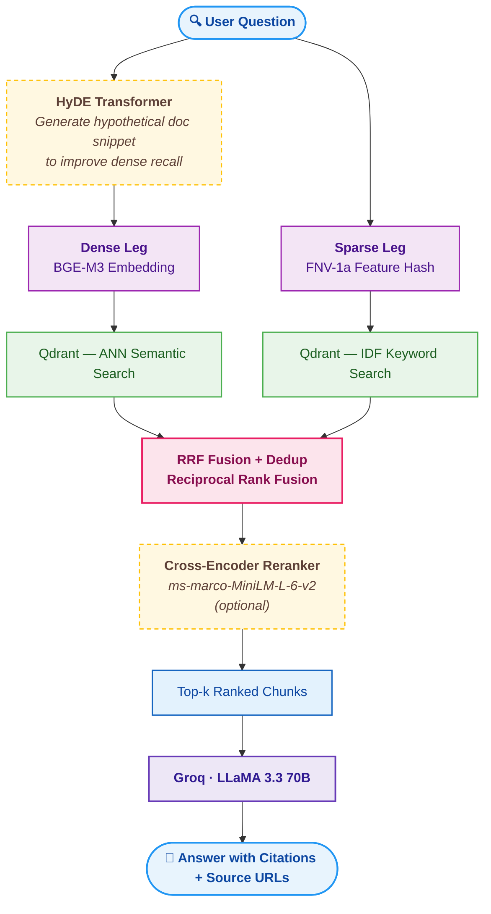

# RAG PyTorch Documentation Assistant

[](LICENSE)
[](https://groq.com/)
[](https://qdrant.tech/)
[](https://t.me/techdoc_assistant_bot)

A retrieval-augmented generation (RAG) system that answers questions about PyTorch using the official documentation as its knowledge base. It blends dense semantic search with sparse keyword search, fuses results via Reciprocal Rank Fusion, optionally reranks with a cross-encoder, and produces citation-backed answers using an LLM API — all accessible through a Telegram bot: [@techdoc_assistant_bot](https://t.me/techdoc_assistant_bot).

---

## Table of Contents

- [How It Works](#how-it-works)
- [Evaluation](#evaluation)
- [Tech Stack](#tech-stack)
- [Project Structure](#project-structure)
- [Ingestion Pipeline](#ingestion-pipeline)
- [Telegram Bot](#telegram-bot)
- [Setup](#setup)
  - [1. Development environment](#1-development-environment)
  - [2. Configuration](#2-configuration)
  - [3. Build the knowledge base](#3-build-the-knowledge-base)
  - [4. Run the bot](#4-run-the-bot)
- [Key Design Decisions](#key-design-decisions)
- [Sample Outputs](#sample-outputs)

---

## How It Works

Each incoming question goes through two parallel retrieval paths — dense vector search (BGE-M3 embeddings) and sparse keyword search (FNV-1a feature hashing) — both running against a Qdrant Cloud collection. The results are fused with Reciprocal Rank Fusion, optionally reranked by a cross-encoder, and the top-k chunks are passed to LLaMA 3.3 70B (via Groq) for answer synthesis. Every factual claim in the answer is tagged with an inline `[N]` citation linked back to the source documentation page.

Dense retrieval is optionally boosted by HyDE (Hypothetical Document Embeddings): the LLM first generates a short hypothetical answer, which is embedded and used as the query vector instead of the raw question — significantly improving recall for API-style queries.

<details>
  <summary>Show the diagram</summary>



</details>

---

## Evaluation

RAGAS evaluation on 20 hand-curated PyTorch questions, judged by LLaMA 3.3 70B against Claude Sonnet 4.6 reference answers. The pipeline was evaluated with HyDE and cross-encoder reranking enabled (top-20 candidates, α=0.7, final top-6).

| Metric | Score | What it measures |
|---|:---:|---|
| Faithfulness | **0.95** | Is every claim grounded in the retrieved context? |
| Answer Relevancy | **0.92** | Is the answer on-topic for the question? |
| Context Precision | **0.86** | Are retrieved chunks actually useful for the reference answer? |
| Context Recall | **0.74** | Does the retrieved context cover all claims in the reference? |
| Answer Correctness | **0.67** | How factually correct is the answer compared to the reference? |

The answer correctness gap (0.67) is expected: LLaMA 3.3 70B sometimes produces a correct but differently-worded answer that the embedding-based `AnswerCorrectness` metric penalises.

[RAGAS Evaluation Notebook](notebooks/05_ragas_evaluation.ipynb)

---

## Tech Stack

| Component | Technology |
|---|---|
| Dense embeddings | `BAAI/bge-m3` via `FlagEmbedding` (local, CUDA/CPU) |
| Sparse embeddings | FNV-1a feature hashing + Qdrant IDF modifier |
| Reranker | `cross-encoder/ms-marco-MiniLM-L-6-v2` via `sentence-transformers` (optional) |
| Vector database | Qdrant Cloud (hybrid named-vector collection) |
| Fusion | Reciprocal Rank Fusion (Qdrant Query API ≥ 1.9) |
| Query expansion | HyDE (Hypothetical Document Embeddings) |
| LLM / answer generation | LLaMA 3.3 70B via Groq |
| Chain orchestration | LangChain LCEL |
| HTML parsing | BeautifulSoup + lxml |
| Bot framework | aiogram 3 |
| Deployment | Docker / docker-compose |

---

## Project Structure

<details>
  <summary>Show the project structure</summary>

```
rag-techdoc-assistant/
├── pyproject.toml                 # project metadata & dependencies (uv)
├── devenv.nix                     # devenv shell & package configuration
├── devenv.yaml                    # devenv inputs / follows
├── Dockerfile                     # CPU / HF Inference image
├── docker-compose.yml             # default (CPU) + gpu profile
├── .env                           # secrets (not committed)
├── LICENSE
│
├── notebooks/
│   ├── 01_data_acquisition.ipynb  # crawl & convert PyTorch docs
│   ├── 02_chunking.ipynb          # split pages into retrieval units
│   ├── 03_embedding_ingestion.ipynb  # embed chunks & upsert to Qdrant
│   ├── 04_rag_chain.ipynb         # query the chain end-to-end
│   └── 05_ragas_evaluation.ipynb  # RAGAS evaluation against reference answers
│
├── src/
│   ├── data_acquisition/
│   │   ├── discovery.py           # sitemap crawl → URL list
│   │   ├── fetcher.py             # rate-limited HTTP fetcher
│   │   ├── cleaner.py             # strip UI chrome, Pygments spans
│   │   ├── extractor.py           # structural markers (headings, API symbols)
│   │   ├── converter.py           # HTML → Markdown with section comments
│   │   └── pipeline.py            # DocPage dataclass + orchestration
│   │
│   ├── chunking/
│   │   ├── chunker.py             # ChunkSplitter + Chunk dataclass
│   │   └── incremental.py         # resumable chunk splitting with JSONL cache
│   │
│   ├── embedding/
│   │   ├── embedder.py            # BGEM3Embedder (local CUDA / CPU)
│   │   ├── hf_embedder.py         # HFInferenceEmbedder (API fallback)
│   │   ├── sparse.py              # feature-hashed sparse vectors
│   │   ├── cache.py               # vector cache to avoid re-embedding
│   │   └── lc_adapter.py          # LangChain Embeddings shim
│   │
│   ├── retrieval/
│   │   ├── hyde.py                # HyDE query transformer
│   │   └── reranker.py            # cross-encoder reranker (sentence-transformers)
│   │
│   ├── vectorstore/
│   │   └── store.py               # QdrantDocStore + HybridQdrantRetriever
│   │
│   ├── rag/
│   │   └── chain.py               # build_rag_chain, RAGResult, SourceRef, stream_rag
│   │
│   └── evaluation/
│       └── ragas_runner.py        # checkpoint-backed RAGAS evaluation loop
│
└── bot/
    ├── main.py                    # entry point, lifecycle hooks
    ├── config.py                  # pydantic-settings configuration
    ├── services.py                # lazy chain initialisation, embedder factory
    ├── keyboards.py               # inline source buttons, answer formatting
    ├── query_log.py               # forward queries to a private log group
    ├── handlers/
    │   ├── commands.py            # /start, /help, /status
    │   └── chat.py                # question handler (standard + streaming)
    └── middleware/
        └── throttle.py            # per-user sliding-window rate limiter
```

</details>

---

## Ingestion Pipeline

The knowledge base is built by running four notebooks in order. Each is self-contained and documents its own purpose at the top.

| Notebook | Stage | Output |
|---|---|---|
| `01_data_acquisition` | Crawl `docs.pytorch.org`, clean HTML, convert to Markdown | `data/pytorch_docs/` — one `.md` per page + `_index.jsonl` manifest |
| `02_chunking` | Split pages on structural boundaries; merge stubs; sub-split large sections | `_chunks.jsonl` |
| `03_embedding_ingestion` | Embed chunks with BGE-M3; upsert dense + sparse vectors to Qdrant | Populated hybrid collection |
| `04_rag_chain` | Run queries end-to-end; inspect `RAGResult` with answer + citations | — |

**Chunking strategy** — the HTML converter embeds `<!-- section: anchor -->` and `<!-- api: symbol -->` comments at every structural boundary. The chunker then: (1) splits on those markers, (2) merges forward any stub segments below `min_chars`, and (3) sub-splits oversized sections at paragraph boundaries with a configurable overlap tail.

<details>
  <summary>Pipeline in more detail</summary>

### Stage 1 — Data Acquisition

`notebooks/01_data_acquisition.ipynb`

Crawls `docs.pytorch.org`, cleans the HTML, and converts each page to Markdown. Structural boundaries (headings, API symbols) are embedded as `<!-- section: anchor -->` / `<!-- api: symbol -->` comments that the chunker reads in the next stage.

Outputs `data/pytorch_docs/` — one `.md` file per page and a `_index.jsonl` manifest.

Key parameters (top of notebook):
```python
MAX_PAGES = None          # None = full crawl (~2 750 pages)
RPS       = 2.0           # requests per second — be polite
```

The pipeline is resumable: already-saved URLs are tracked in `_index.jsonl`, so re-running the notebook is a no-op for completed pages.

### Stage 2 — Chunking

`notebooks/02_chunking.ipynb`

Loads the saved pages and splits them into `Chunk` objects using a three-step strategy:

1. **Marker split** — pages are split at every `<!-- section -->` / `<!-- api -->` comment inserted by the converter.
2. **Stub merge** — sections below `min_chars` are merged forward into the next chunk to avoid tiny retrieval units.
3. **Overlap sub-split** — sections exceeding `max_chars` are broken at paragraph boundaries, with a configurable tail copied into the start of the next sub-chunk for continuity.

Each `Chunk` carries the `page_url`, `citation_url` (deep-link with anchor), `kind` (`heading` vs Sphinx API type), `symbol`, and `keywords` for the sparse leg.

### Stage 3 — Embedding & Ingestion

`notebooks/03_embedding_ingestion.ipynb`

- Embeds all chunks with `BGEM3Embedder` (1 024-dim, L2-normalised, cached to `_vectors.npy` for incremental runs).
- Computes sparse vectors via `keywords_to_sparse` (FNV-1a TF weights).
- Creates (or re-uses) a Qdrant hybrid collection with named vectors `dense` and `keywords`.
- Upserts chunks with their payloads using batched `upsert_chunks`.

### Stage 4 — RAG Chain Exploration

`notebooks/04_rag_chain.ipynb`

Interactive notebook for end-to-end chain testing. Includes a single-query demo, streaming demo, and a small batch evaluation harness.

</details>

---

## Telegram Bot

The bot is live at [@techdoc_assistant_bot](https://t.me/techdoc_assistant_bot).

**Commands**

| Command | Description |
|---|---|
| `/start` | Introduction and usage examples |
| `/help` | Help text and tips for better answers |
| `/status` | Pipeline health check and collection stats |

---

## Setup

### 1. Development environment

This project uses [devenv](https://devenv.sh) to provide a fully reproducible environment, with [direnv](https://direnv.net) for automatic shell activation.

* **With direnv (recommended):** Allow the `.envrc` once and the devenv shell activates automatically whenever you enter the project directory:

    ```bash
    direnv allow
    ```

* **Without direnv:** Enter the shell manually:

    ```bash
    devenv shell
    ```

    Either way, you will have the correct Python version and all dependencies, including `uv`.

* **Without devenv:** Ensure you have Python 3.12 and [uv](https://docs.astral.sh/uv/) installed, then install dependencies directly:

    ```bash
    uv sync
    ```

> BGE-M3 downloads ~2.2 GB of weights from HuggingFace Hub on first run.

### 2. Configuration

<details>
  <summary>Create the <code>.env</code> file in the project root.</summary>

```env
# --- Telegram ---
TELEGRAM_BOT_TOKEN=<your-telegram-bot-token>

# --- Qdrant Cloud ---
QDRANT_URL=https://<your-cluster>.cloud.qdrant.io
QDRANT_API_KEY=<your-qdrant-api-key>

# --- Groq (LLM) ---
GROQ_API_KEY=<your-groq-api-key>

# --- HuggingFace (required when EMBEDDER_MODE=hf or auto) ---
HUGGINGFACEHUB_API_TOKEN=<your-hf-token>

# --- RAG pipeline ---
COLLECTION_NAME=pytorch_docs
TOP_K=6
MAX_TOKENS=1024
TEMPERATURE=0.0
HYDE_ENABLED=true

# --- Embedder ---
# auto  → try local BGEM3Embedder first, fall back to HF Inference API
# local → always use local model (requires torch + FlagEmbedding)
# hf    → always use HuggingFace Inference API
EMBEDDER_MODE=auto

# --- Cross-encoder reranker (optional) ---
RERANKER_ENABLED=false
RERANKER_ALPHA=0.7        # blend weight: 1.0 = pure CE, 0.0 = pure RRF
RERANKER_TOP_K=12         # candidates fetched before reranking; final = TOP_K

# --- Streaming (Telegram Bot API 9.5+ sendMessageDraft) ---
STREAMING_ENABLED=false
STREAMING_DRAFT_INTERVAL=0.2   # seconds between draft updates

# --- Rate limiting ---
RATE_LIMIT_MAX=5               # max requests per user per window
RATE_LIMIT_WINDOW=60           # rolling window in seconds

# --- Access control (optional) ---
ALLOWED_USER_IDS=              # comma-separated Telegram user IDs; empty = public
LOG_GROUP_ID=                  # Telegram chat ID to forward query logs to
```

</details>

Check [.env.example](.env.example) for a template.

### 3. Build the knowledge base

Run notebooks `01` through `03` in order (see [Ingestion Pipeline](#ingestion-pipeline) above).

### 4. Run the bot

* **Locally:**

    ```bash
    python -m bot.main
    ```

* **Docker (CPU / HF Inference embedder):**

    ```bash
    docker compose up --build
    ```

    > The CPU image uses `EMBEDDER_MODE=hf` and requires `HUGGINGFACEHUB_API_TOKEN`. Before building, export a `requirements.txt` from the project dependencies:
    > ```bash
    > uv export --no-dev --extra bot > requirements.txt
    > ```

* **Docker (GPU / local BGE-M3 embedder — requires `nvidia-container-toolkit`):**

    ```bash
    docker compose --profile gpu up --build
    ```

---

## Key Design Decisions

**Hybrid retrieval with RRF.** Dense ANN (semantic similarity) and sparse keyword search (exact symbol matching) are run as separate prefetch legs in the Qdrant Query API. Reciprocal Rank Fusion merges them without any tunable weight — it is parameter-free and robust across the very different score distributions of the two legs.

**Split-channel HyDE.** The HyDE transformer generates a hypothetical documentation snippet and uses it *only* for the dense embedding. The sparse leg always receives the original query. This keeps exact symbol names (e.g. `torch.autocast`) firmly in the keyword leg where they belong, while letting the dense leg operate on semantically richer text.

**CE + RRF score blending.** After RRF fusion, an optional `CrossEncoderReranker` rescores each (query, passage) pair with `cross-encoder/ms-marco-MiniLM-L-6-v2` and blends the two signals: `final = α · CE_norm + (1 − α) · RRF_norm`, where both scores are min-max normalised within the batch before combining. The bi-encoder retrieves a wider candidate pool (`RERANKER_TOP_K`, e.g. 12–20) and the cross-encoder re-orders it before the final `TOP_K` slice. α=0.7 (CE-leaning) is the default; setting α=0.0 degrades gracefully to pure RRF order without loading the model. The reranker is optional and degrades gracefully if `sentence-transformers` is not installed.

**Feature-hashed sparse vectors.** Using a vocabulary-free hashing trick (FNV-1a, 2¹⁷ buckets) means new pages can be upserted at any time without rebuilding a vocabulary artefact. Qdrant's IDF modifier applies collection-level IDF to queries at search time, giving BM25-like scoring without any offline IDF computation.

**Structured RAG output.** `build_rag_chain` returns a `RAGResult` dataclass. Citation markers (`[N]`) in the answer are resolved back to `SourceRef` objects (URL, title, symbol) before the result is returned, so callers never need to parse footnotes themselves.

**Resumable crawl.** The data acquisition pipeline tracks already-saved URLs in `_index.jsonl`. Re-running the notebook is a no-op for completed pages, making incremental updates straightforward. The same pattern applies to chunking (`_chunks.jsonl`) and embedding (`_vectors.npy` + `_vector_ids.json`).

---

## Sample Outputs

<details>
  <summary>Q: How do I move a tensor to GPU?</summary>

```
You can move a tensor to GPU using the to() method [1] or the cuda() method [2].
The to() method allows you to specify the device, dtype, and other options,
while the cuda() method returns a copy of the tensor in CUDA memory [2]. 

For example, you can use tensor.to(device=cuda) [1] or tensor.cuda() [2] to move
a tensor to the default CUDA device, or tensor.to(device=cuda2) [1] or
tensor.cuda(cuda2) [2] to move a tensor to a specific GPU, such as GPU 2 [3]. 

Additionally, you can use the torch.device object to specify the device, such as
cuda = torch.device('cuda') [3]. 

It is also possible to use the with torch.cuda.device(1): context manager to
allocate tensors on a specific GPU [3]. 

Note that the to() method and cuda() method have similar parameters, including
device, non_blocking, and memory_format [1][2].

Sources
----------------------------------------
[1] torch.Tensor.to
     https://docs.pytorch.org/docs/stable/generated/torch.Tensor.to.html#torch.Tensor.to
[2] torch.Tensor.cuda
     https://docs.pytorch.org/docs/stable/generated/torch.Tensor.cuda.html#torch.Tensor.cuda
[3] CUDA semantics
     https://docs.pytorch.org/docs/stable/notes/cuda.html#cuda-semantics
```

</details>

<details>
  <summary>Q: What is the difference between <code>torch.Tensor</code> and <code>torch.tensor</code>?</summary>

```
The difference between `torch.Tensor` and `torch.tensor` is that `torch.Tensor`
is a class [1], whereas `torch.tensor` is a function that constructs a tensor [2].

`torch.tensor` is the recommended way to create a tensor, and it is equivalent to
using the `torch.Tensor` class, but with a more functional API [1].

Additionally, there is a legacy constructor `torch.Tensor` whose use is
discouraged, and it is recommended to use `torch.tensor()` instead [1].

It's also worth noting that `torch.tensor()` creates a tensor with no autograd
history, whereas `torch.Tensor` can be created with `requires_grad=True` to
record operations for automatic differentiation [3].

Sources
----------------------------------------
  [1] torch.Tensor
       https://docs.pytorch.org/docs/stable/tensors.html#torch.Tensor
  [2] torch.tensor
       https://docs.pytorch.org/docs/stable/generated/torch.tensor.html#torch.tensor
  [3] torch.Tensor
       https://docs.pytorch.org/docs/stable/tensors.html#initializing-and-basic-operations
```

</details>

<details>
  <summary>Q: How does gradient checkpointing reduce memory usage?</summary>

```
Gradient checkpointing reduces memory usage by not keeping alive tensors
computed during the forward pass until they are used in gradient computations
in the backward pass [1]. Instead, any passed tensors in args are kept alive,
and the unsaved tensors are recomputed by re-invoking function in the backward
pass as needed for gradient computation [1]. This technique is known as
activation checkpointing and can be applied to any part of a model [1].

Sources
----------------------------------------
[1] torch.utils.checkpoint.checkpoint
     https://docs.pytorch.org/docs/stable/checkpoint.html#torch.utils.checkpoint.checkpoint
```

</details>

<details>
  <summary>Q: What does <code>torch.no_grad()</code> do and when should I use it?</summary>

```
torch.no_grad() is a context-manager that disables gradient calculation [1]. It
is useful for inference, when you are sure that you will not call
Tensor.backward() [1]. Disabling gradient calculation reduces memory consumption
for computations that would otherwise have requires_grad=True [1]. 

You should use torch.no_grad() when you need to perform operations that should
not be recorded by autograd, but you’d still like to use the outputs of these
computations in grad mode later [2]. For example, it might be useful when
writing an optimizer or when initializing parameters [2]. 

Note that torch.no_grad() does not apply to forward-mode AD [1][3][4] and is one
of several mechanisms that can enable or disable gradients locally [1][4][5][6]. 

In summary, use torch.no_grad() when you want to disable gradient calculation
for a block of code or function, and you intend to use the outputs of these
computations in grad mode later [1][2].

Sources
----------------------------------------
[1] torch.no_grad 
     https://docs.pytorch.org/docs/stable/generated/torch.no_grad.html#torch.no_grad
[2] Autograd mechanics
     https://docs.pytorch.org/docs/stable/notes/autograd.html#no-grad-mode
[3] torch.func.grad
     https://docs.pytorch.org/docs/stable/generated/torch.func.grad.html#torch.func.grad
[4] torch.autograd.grad_mode.inference_mode
     https://docs.pytorch.org/docs/stable/generated/torch.autograd.grad_mode.inference_mode.html#torch.autograd.grad_mode.inference_mode
[5] torch
     https://docs.pytorch.org/docs/stable/torch.html#locally-disabling-gradient-computation
[6] torch.enable_grad
     https://docs.pytorch.org/docs/stable/generated/torch.enable_grad.html#torch.enable_grad
```

</details>

<details>
  <summary>Q: How does <code>torch.autograd.grad</code> differ from calling <code>.backward()</code>?</summary>

```
torch.autograd.grad differs from calling .backward() in that it computes and
returns the sum of gradients of outputs with respect to the inputs, whereas
.backward() accumulates gradients in the leaves [1][2]. Additionally,
torch.autograd.grad allows for more flexibility, such as specifying grad_outputs
and retain_graph, and returns the gradients as a tuple of tensors, whereas
.backward() modifies the .grad attributes of the tensors in-place [1][2]. It is
also noted that using torch.autograd.grad is recommended over
torch.autograd.backward when creating a graph to avoid memory leaks [1].

Sources
----------------------------------------
[1] torch.autograd.backward
    https://docs.pytorch.org/docs/stable/generated/torch.autograd.backward.html#torch.autograd.backward
[2] torch.autograd.grad
    https://docs.pytorch.org/docs/stable/generated/torch.autograd.grad.html#torch.autograd.grad
```

</details>
